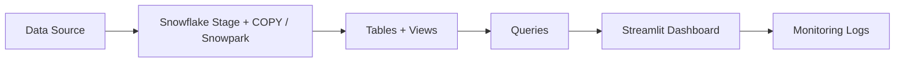

# CS 5542 — Week 5 Snowflake Integration Starter

This starter kit provides a minimal, reproducible **Data → Snowflake → Query → App → Logging** pipeline.

## Repo Layout
- `sql/`: schema, staging/loading, and query examples
- `scripts/`: connection + local CSV → stage → COPY loader
- `app/`: Streamlit dashboard connected to Snowflake
- `data/`: sample CSVs (replace with your project subset)
- `logs/`: pipeline usage logs
- `CONTRIBUTIONS.md`: individual accountability

## Week 5 Scope (≈50%)
Fill in what you included vs deferred.

| Item | Included this week | Deferred |
|---|---|---|
| Dataset(s) |  |  |
| Feature(s) |  |  |

## End-to-End Flow


## Setup
1) Create `.env` from `.env.example` and fill your Snowflake values.
2) Install dependencies:
```bash
pip install -r requirements.txt
```

## Snowflake SQL Setup
Run these scripts in a Snowflake Worksheet (in order):
- `sql/01_create_schema.sql`
- `sql/02_stage_and_load.sql`

## Load Data (example)
This script uploads a local CSV to an internal stage and loads it into a table.
```bash
python scripts/load_local_csv_to_stage.py data/events.csv EVENTS
python scripts/load_local_csv_to_stage.py data/users.csv USERS
```

## Run App
```bash
streamlit run app/streamlit_app.py
```

## Extensions Completed
- Extension 1:
- Extension 2:
- Extension 3: (if applicable)

## Demo Video Link
- 

## Notes / Bottlenecks
- 
